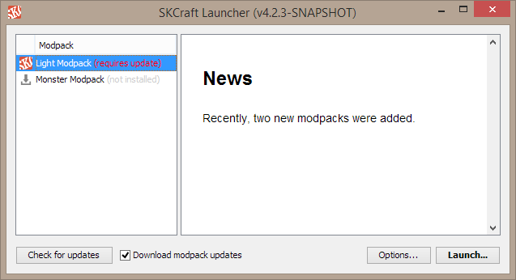
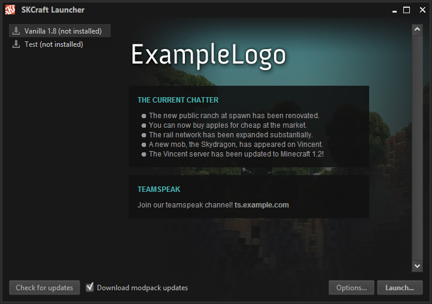
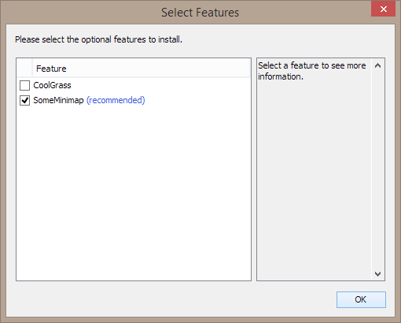

SKCraft Launcher
================

This project provides an open-source Minecraft launcher platform for downloading, installing, and updating modpacks.

The launcher has its roots in MC Alpha as a launcher for sk89q's server.

**Note:** There are two names to the launcher:

* "SKMCLauncher" is the *older* version of this launcher. It is a more generic all-purpose launcher. It is no longer supported.
* This project is called "SKCraft Launcher." It is supported and in active use.

## Screenshots

Skinned version (in `launcher-fancy`):

## Features

### For the modpack creator:

* No config files (aside from two at the start) needed to make a modpack -- you just make a folder with the modpack's files and run the builder tool on it
* Supports putting default files (config files, etc.) that are not overridden on a future update
* Supports the removal of files (which, from the PoV of the modpack creator, just involves deleting the file from the folder)
* Supports "optional" files or file sets that can be toggled on or off by the user
* The same directory can be used to create both a client modpack and a server modpack simultaneously (with server-only or client-only files) so you don't need to maintain two separate copies of the same files

### Technical features:

* Fast parallel downloads
* Incremental updates (downloading only changed files)
* Can update from ANY previous version to the latest version
* Updates can be resumed if they've failed or have been cancelled
* Updates also resume from where they left off
* Static file structure so it can be placed on a CDN without modification
* Files are deduplicated (on the file host) so you only ever have ONE version of a file across all modpacks and all modpack versions
* Option for users to enter a special key in the options dialog that can be used to show additional modpacks (i.e. private ones for testing) -- this requires some server-side code
* Can be used with a continuous integration system so you can combine it with your favorite version control (i.e. Git, SVN) and automatically deploy a new modpack update on push/tag

### Client features:

* Multiple modpacks are supported
* Custom news page for showing custom information
* Multiple profile support
* Log messages dialog with upload log option
* Options to adjust memory settings and Java flags
* Everything happens in a background thread so the UI never freezes
* All tasks have cancel buttons and (reasonably accurate) progress dialogs if things take too long
* Self-update mechanism (however, this requires a separate bootstrapper project)

## Getting Started

* [Read the wiki](https://github.com/SKCraft/Launcher/wiki)
* [Forum to ask for help](http://forum.enginehub.org/forums/launcher.25/)

## Compiling

In your command prompt or terminal, run:

	./gradlew clean build

If you are on Windows:

	gradlew clean build

If you wish to import the project into an IDE, you must add support for Project Lombok (IntelliJ IDEA users: also enable annotation processing in compiler settings).

## Contributing

Pull requests can be submitted on GitHub, but we will accept them at our discretion. Please note that your code must follow Oracle's Java Code Conventions.

Contributions by third parties must be dual licensed under the two licenses described within LICENSE.txt (GNU General Public License, version 3, and the 3-clause BSD license).

## License

The launcher is licensed under the GNU General Public License, version 3.
